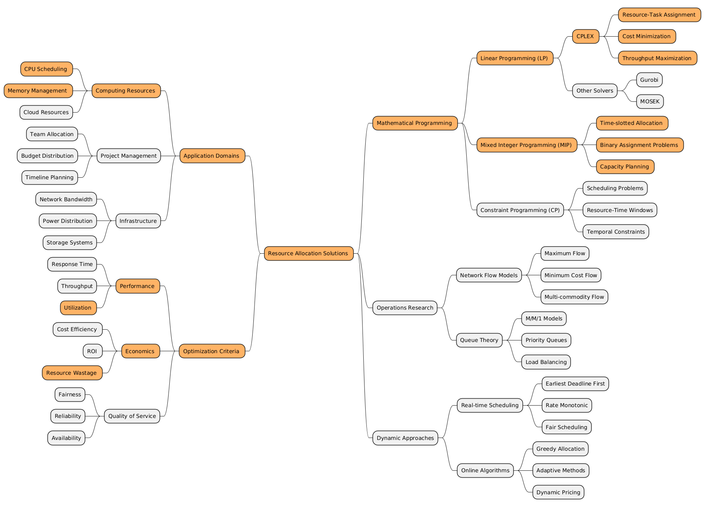
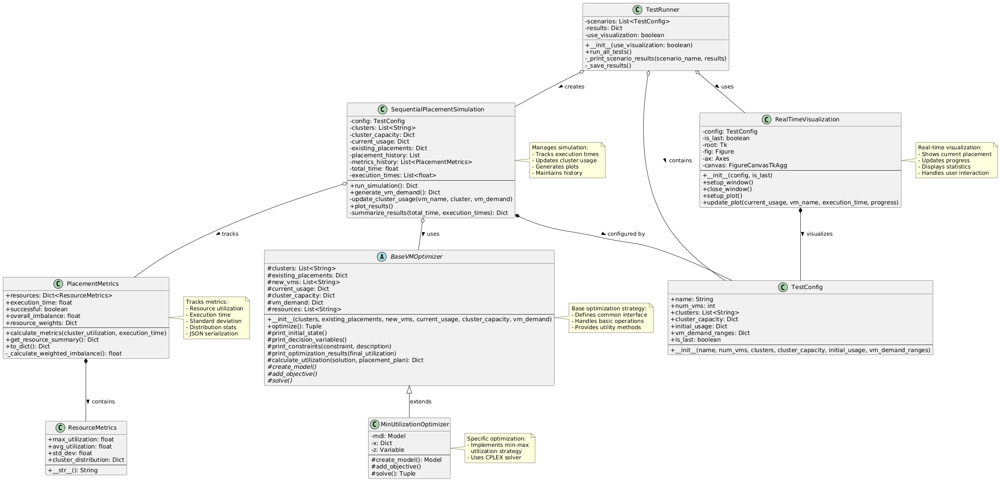

# VM Placement Optimization

This project implements optimization strategies for placing virtual machines (VMs) across multiple clusters while balancing resource utilization and maintaining performance constraints.

## Problem Description

Given:
- Multiple clusters with defined resource capacities (CPU, Memory, Disk)
- Existing VMs already placed in clusters
- New VMs that need to be placed
- Resource demands for each VM
- Current resource utilization of each cluster

Goals:
1. Place new VMs across clusters efficiently
2. Balance resource utilization across clusters
3. Minimize resource wastage
4. Maintain performance and capacity constraints

## Approach

### Base Implementation (without hosts)

The project implements a sequential placement strategy using mixed-integer linear programming (MILP):

1. **Sequential Placement**: VMs are placed one at a time, considering:
   - Current cluster utilization
   - Resource demands of the VM
   - Available capacity in each cluster
   - Impact on overall cluster balance

2. **Optimization Objectives**:
   - Minimize maximum resource utilization across clusters
   - Balance load across different resource types (CPU, Memory, Disk)
   - Ensure feasible placement within capacity constraints

3. **Metrics Tracked**:
   - Resource utilization per cluster
   - Standard deviation of resource usage
   - Imbalance scores
   - Execution time
   - Placement success rate

### Extended Implementation (with hosts)

Additional complexity considering individual hosts within clusters:
- Host-level capacity constraints
- Cluster-level balancing
- More granular resource management

## Project Structure

- `without_hosts/`: Base implementation focusing on cluster-level optimization
  - `models/`: Optimization strategy implementations
  - `metrics.py`: Resource utilization and performance metrics
  - `sequential_placement.py`: Main placement simulation logic

- `with_hosts/`: Extended implementation including host-level constraints
  - Similar structure with additional host management

## Usage

The project provides:
1. Different optimization strategies through base optimizer class
2. Real-time visualization of placement progress
3. Detailed metrics and analysis
4. JSON output for result analysis
5. Configurable test scenarios

## Key Features

- Modular optimization strategies
- Real-time visualization
- Comprehensive metrics
- Extensible architecture
- Test scenario configuration

## Future Improvements

1. Additional optimization strategies
2. Multi-objective optimization
3. Dynamic resource demand handling
4. Machine learning integration for prediction
5. Enhanced visualization and reporting
